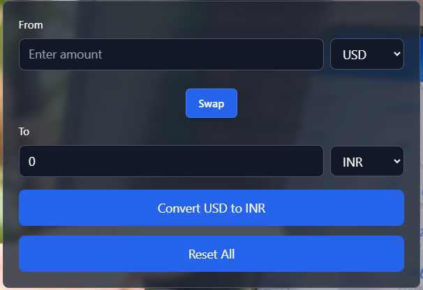
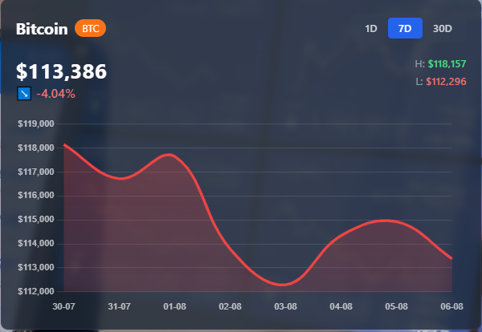

# 💱 CryptoHub - Currency Converter & Crypto Dashboard


A modern React-based cryptocurrency dashboard featuring:
- **Currency Converter** with live exchange rates.
- **BTC Chart** (day-wise prices).
- **Crypto News Feed** for the latest market updates.
- **Live Crypto Prices Header** (BTC, ETH, BNB, SOL).
- **GitHub link** for quick access to the repository.

---

## 🚀 Features
- 🌐 **Real-time currency conversion** using [Fawaz Currency API](https://github.com/fawazahmed0/currency-api).
- 📊 **BTC day-wise chart** powered by [CoinGecko API](https://www.coingecko.com/).
- 📰 **Crypto news section** (free API-based news feed).
- 💹 **Live crypto ticker** in the header.
- 🎨 **Beautiful UI** with TailwindCSS.
- 🔔 **Swap confirmation toast notifications** using `react-toastify`.
- 🔗 **GitHub repo link** at the bottom of the header.

---

## 🛠️ Tech Stack
- **React.js** (with Hooks)
- **Vite** (for fast development)
- **Tailwind CSS** (for styling)
- **Chart.js + react-chartjs-2** (for BTC chart)
- **React Toastify** (notifications)
- **CoinGecko API** (crypto prices)
- **Fawaz Currency API** (currency exchange rates)

---

## 📂 Project Structure
currencyconverter/
│
├── public/
│   └── screenshots/
│       ├── converter.png
│       ├── chart.png
│       └── dashboard.png
│
├── src/
│   ├── components/
│   │   ├── Converter.jsx
│   │   ├── BTCChart.jsx
│   │   ├── CryptoNews.jsx
│   │   ├── CryptoHubHeader.jsx
│   │   └── InputBox.jsx
│   │
│   ├── hooks/
│   │   └── useCurrencyInfo.js
│   │
│   ├── services/
│   │   ├── currencyService.js
│   │   ├── cryptoService.js
│   │   └── newsService.js
│   │
│   ├── styles/
│   │   └── App.css
│   │
│   ├── utils/        
│   │
│   ├── App.jsx
│   ├── main.jsx
│   └── index.css
│
└── package.json

## 📸 Screenshots




---


## ⚡ Installation

1. **Clone the repo**
   ```
   git clone https://github.com/chandrakxnt/currencyconverter.git
   cd currencyconverter

2. **Install dependencies**
    ```
    npm install

3. **Run the development server**
    ```
    npm run dev
